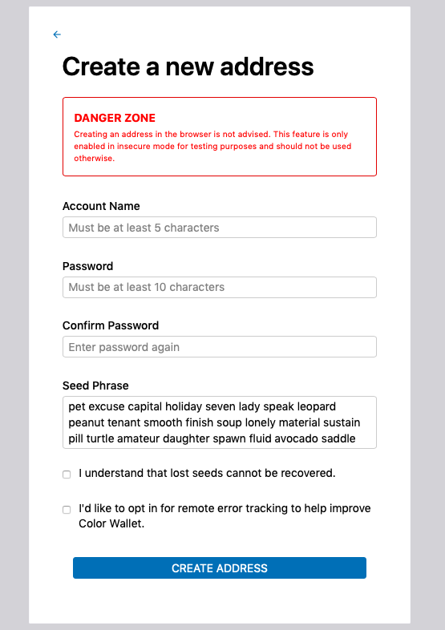
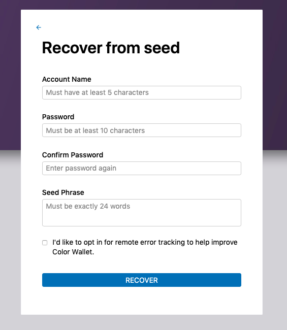

### <b>How to create new wallet </b>

To create new wallet click on `Sign in` Button. </br>
Now click on `Create a new address`.

 </br>
Enter your desired account name, and password (atleast 10 characters required). And click on Create Address button. </br>


> _NOTE_: **Save your seed phrase somewhere safe** ,as it is the only way to recover your wallet.


### <b>Import/Recover Account </b>

Users can import or recover their wallet using their seed phrase/mnemonic. </br>
To recover account click on `Sign in`, then select `Recover with backup code`. </br>

 </br>

Now enter your desired account name, password and the seed phrase of the account you want to recover/import. 

### Install the binaries

Next, let's install the latest version of Color.

```bash
mkdir -p $GOPATH/src/github.com/cosmos
cd $GOPATH/src/github.com/cosmos
git clone https://github.com/usmanfazil/colorproject
cd colorproject && make install
```

> _NOTE_: If you have issues at this step, please check that you have the latest stable version of GO installed.

That will install the `colord` and `colorcli` binaries. Verify that everything is OK:

```bash
$ colord version --long
$ colorcli version --long
```

`colorcli` for instance should output something similar to:

```
name: color
servername: colord
clientname: colorcli
build tags: netgo ledger
go version go1.12 linux/amd64
```

##### Build Tags

Build tags indicate special features that have been enabled in the binary.

| Build Tag | Description                                     |
| --------- | ----------------------------------------------- |
| netgo     | Name resolution will use pure Go code           |
| ledger    | Ledger devices are supported (hardware wallets) |


<!-- ### Developer Workflow

To test any changes made in the SDK or Tendermint, a `replace` clause needs to be added to `go.mod` providing the correct import path.

- Make appropriate changes
- Add `replace github.com/cosmos/cosmos-sdk => /path/to/clone/cosmos-sdk` to `go.mod`
- Run `make clean install` or `make clean build`
- Test changes -->

### Next

Now you can [create you own testnet](./colord.md)


```bash
mkdir -p $HOME/go/bin
echo "export GOPATH=$HOME/go" >> ~/.bash_profile
echo "export PATH=\$PATH:\$GOPATH/bin" >> ~/.bash_profile
source ~/.bash_profile
```

::: tip
**Go 1.12+** is required.
:::
